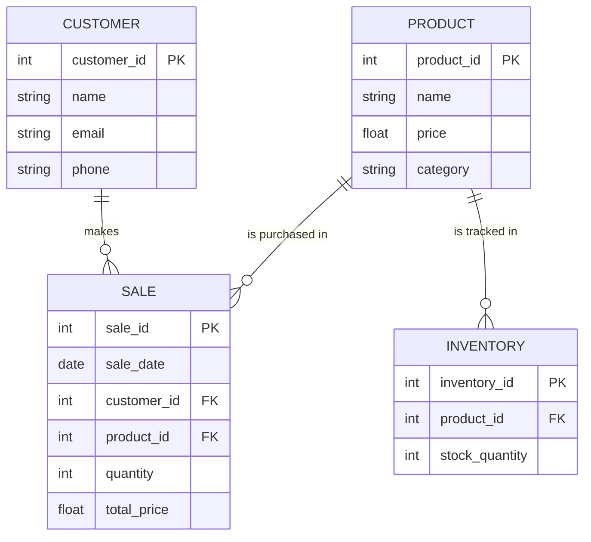

# Nike Shoe Store Entity-Relationship Diagram (ERD)

This ERD models the database for a Nike shoe store to manage products, customers, sales, and inventory.

## Entities and Attributes

 **PRODUCT**: Represents the shoes sold in the store.
   - `product_id`: Unique identifier for each product.
   - `name`: Name of the shoe model.
   - `price`: Price of the product.
   - `category`: Type of shoe (running, basketball).

 **CUSTOMER**: Stores customer details.
   - `customer_id`: Unique identifier for each customer.
   - `name`: Name of the customer.
   - `email`: Email address.
   - `phone`: Phone number.

 **SALE**: Tracks sales transactions.
   - `sale_id`: Unique identifier for each sale.
   - `sale_date`: Date of the sale.
   - `customer_id`: Foreign key linked to the CUSTOMER.
   - `product_id`: Foreign key linked to the PRODUCT.
   - `quantity`: Number of products purchased.
   - `total_price`: Sale total.

 **INVENTORY**: Tracks stock levels.
   - `inventory_id`: Unique identifier for inventory records.
   - `product_id`: Foreign key linked to the PRODUCT.
   - `stock_quantity`: Current stock level.

## Relationships

- **CUSTOMER to SALE**: Each customer can make many sales.
- **PRODUCT to SALE**: Each product can appear in many sales.
- **PRODUCT to INVENTORY**: Each product is tracked in inventory.
